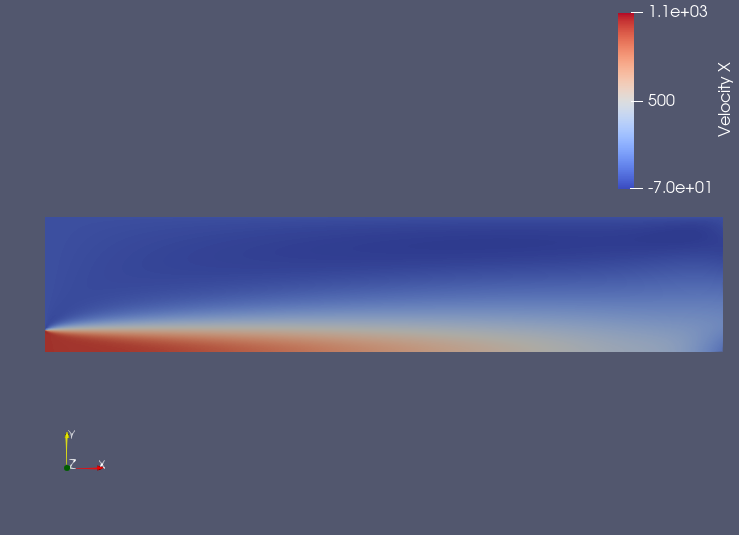

# Turbulent Axisymmetric Jet Flow Simulation with SU2CFD

This contains the simulation setup and results for a turbulent axisymmetric steady-state jet flow using SU2CFD.

## Problem Statement

The objective of this simulation is to study the turbulent behavior of an axisymmetric jet flow. Tasks include generation a 2D mesh for an axisymmetric, steady-state, turbulent jet case using Gmsh, setup configuration, running the simulation, and extracting results.

## Methodology

- **Solver:** SU2CFD, an open-source computational fluid dynamics solver.
- **Geometry and Mesh** Axisymmetric nozzle geometry representing the jet inlet(D) on the lower left surface. Domain width is chosen 10D to capture the velocity diffusion and turbulence across y-direction. Length of the domain is greater than 30D. Structured mesh is generated. Mesh elements near the jet flow are generated of higher density to capture the spread better. No. of mesh elements are 9282. No. of merkers are 4. "inlet" for jet inlet. "wall" is top surface and reamining part of the left surface(other than inlet). "outlet" and "symmetry" as bottom surface.
- **Turbulence Model, Boundary Conditions:**
```text
SOLVER= INC_RANS
KIND_TURB_MODEL= SST

% -------------------- BOUNDARY CONDITION DEFINITION --------------------------%
MARKER_HEATFLUX= ( wall, 0.0 )
AXISYMMETRIC= YES
MARKER_SYM= ( symmetry )

INC_INLET_TYPE= VELOCITY_INLET
MARKER_INLET= ( inlet, 300.0, 1.0, 1.0, 0.0, 0.0)
SPECIFIED_INLET_PROFILE= NO

INC_OUTLET_TYPE= PRESSURE_OUTLET
MARKER_OUTLET= ( outlet, 0.0)

MARKER_PLOTTING= ( wall )
MARKER_MONITORING= ( wall )

% --------------------------- CONVERGENCE PARAMETERS --------------------------%
CONV_FIELD= RMS_PRESSURE
CONV_RESIDUAL_MINVAL= -6
```
## Results
Convergence history output is in history.csv.
The simulation produced the following volume output:

