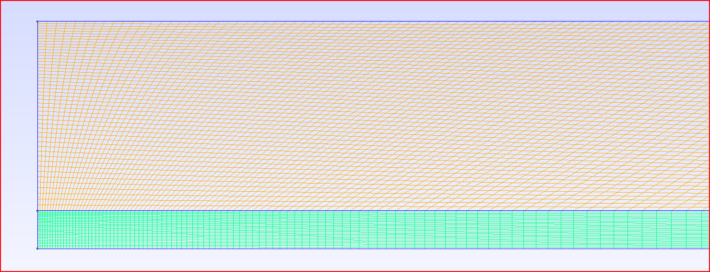

# Turbulent Axisymmetric Jet Flow Simulation with SU2CFD

This contains the simulation setup and results for a turbulent axisymmetric steady-state jet flow using SU2CFD.

## Problem Statement

The objective of this simulation is to study the turbulent behavior of an axisymmetric jet flow. Tasks include generation a 2D mesh for an axisymmetric, steady-state, turbulent jet case using Gmsh, setup configuration, running the simulation, and extracting results.

## Methodology

- **Solver:** SU2CFD, an open-source computational fluid dynamics solver.
- **Geometry and Mesh** The axisymmetric nozzle geometry represents the jet inlet (D) located on the lower left surface, with a domain width chosen to be 10D to adequately capture velocity diffusion and turbulence across the y-direction. The length of the domain exceeds 30D. A structured mesh is generated, ensuring consistency and control over element distribution. Higher mesh density is applied near the jet flow region to accurately capture flow spread. In total, the mesh comprises 9282 elements. Four markers are defined to delineate different boundary conditions: "inlet" for the jet inlet, "wall" for the top surface and remaining part of the left surface (excluding the inlet), "outlet" for the domain's bottom surface, and "symmetry" for the symmetry plane.
<p align="center">
    
</p>

- **Turbulence Model, Boundary Conditions:**
```text
SOLVER= INC_RANS
KIND_TURB_MODEL= SST

% -------------------- BOUNDARY CONDITION DEFINITION --------------------------%
MARKER_HEATFLUX= ( wall, 0.0 )
AXISYMMETRIC= YES
MARKER_SYM= ( symmetry )

INC_INLET_TYPE= VELOCITY_INLET
MARKER_INLET= ( inlet, 300.0, 1.0, 1.0, 0.0, 0.0)
SPECIFIED_INLET_PROFILE= NO

INC_OUTLET_TYPE= PRESSURE_OUTLET
MARKER_OUTLET= ( outlet, 0.0)

MARKER_PLOTTING= ( wall )
MARKER_MONITORING= ( wall )

% --------------------------- CONVERGENCE PARAMETERS --------------------------%
CONV_FIELD= RMS_PRESSURE
CONV_RESIDUAL_MINVAL= -6
```
## Results
Convergence history output is in history.csv.
The simulation produced the following volume output:
<p align="center">
    
</p>
