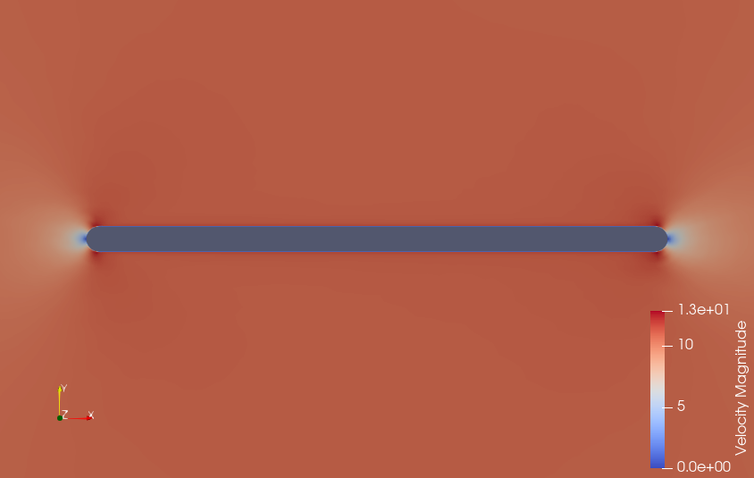

# Python Wrapper Test Case for SU2 Code

This repository contains a test case for the Python wrapper of the SU2 code, demonstrating how to set up a problem using the wrapper and run a test case.

## Problem Description

The test case simulates unsteady conjugate heat transfer (CHT) over a flat plate using the Python wrapper for SU2. The problem setup includes defining the configuration file and using a mesh file to discretize the domain.

## Usage

To run the test case, follow these steps:

1. **Clone the Repository:**
   Clone this repository to your local machine using the following command:
2. **Navigate to Test Case Directory:**
Change into the directory of the Python wrapper test case:
3. **Set Up Configuration:**
Edit the configuration file `config_flatPlate.cfg` to specify the problem parameters such as boundary conditions, solver settings, and physical properties.
4. **Provide Mesh File:**
Place the mesh file (`mesh.su2`) in the same directory. Ensure that the mesh file corresponds to the problem geometry and discretization requirements.
5. **Run the Test Case:**
Execute the test case script `launch_unsteady_CHT_FlatPlate.py` using Python(I ran the case using multiple threads with mpi):
```
$mpirun -np X python3 -m mpi4py /your/path/to/run.py --parallel -f your.cfg
```
6. **Monitor Progress:**
The script will run the simulation using the specified configuration and mesh files. Monitor the progress in the terminal for any errors or warnings.

7. **View Results:**
Once the simulation completes successfully, the results will be stored in the output directory. Use post-processing tools such as ParaView to visualize the results and analyze the flow field and temperature distribution.

## Additional Information

- The Python wrapper provides a convenient interface for setting up and running simulations with the SU2 code using Python scripts.
- Refer to the SU2 documentation for detailed information on configuring the simulation parameters and understanding the output files.
- For questions or issues related to the Python wrapper or this test case, please refer to the SU2 community forums or open an issue on the GitHub repository.

## My Results

