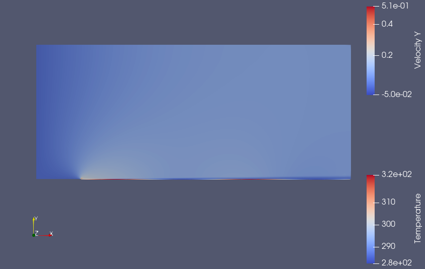

# Modification of Python Wrapper Setup for Spatially Varying Wall Temperature

This task contains modifications to the Python wrapper setup for the SU2 code to enable a spatially varying wall temperature for a steady-state compressible turbulent flat plate testcase.

## Problem Setup

- **Flat Plate Length:** 1.5 meters
- **Boundary Conditions:**
  - Adiabatic no-slip wall boundary condition along the flat plate.
  - Symmetry plane located before the leading edge of the flat plate.
  - Inlet boundary condition on the left boundary.
  - Outlet boundary condition applied to the top and right boundaries.
- **Freestream Conditions:**
  - Velocity: 50.1 m/s
  - Density: 1.2 kg/m^3
  - Viscosity: 1.8e-05
  - Turbulence intensity: 0.18% (u’/U=0.0018)
- **Compressibility Effects:** Negligible (Mach number ≈ 0.15)

## Modification Details

To enable a spatially varying wall temperature, the following code snippet can be incorporated into the Python wrapper:

```python
wall_temperature_amplitude = 20.0  
wall_temperature_mean = 302.4 
newTemp=0
for iVertex in range(nVertex_Marker):
    MarkerCoords = SU2Driver.MarkerCoordinates(MarkerID)
    x = MarkerCoords(iVertex, 0)
    newTemp = wall_temperature_mean + np.sin(2*np.pi*x)*wall_temperature_amplitude
    SU2Driver.SetMarkerCustomTemperature(MarkerID, iVertex, newTemp)
```

<p align="center">
    
</p>
